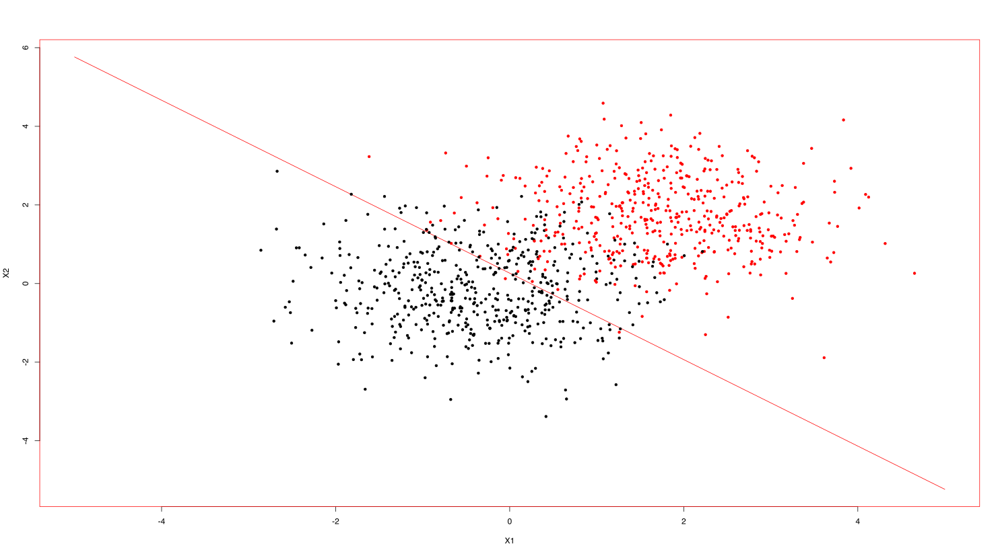

# Perceptron network in Elixir 

The [`Elixir`](https://elixir-lang.org/) implementation of perceptron.

The [Matrex project](https://github.com/versilov/matrex) is used for all matrix manipultions.

Design goals:
* Multiple layers running at the same time
* Forward propagation -  have layers talking to each other fully/partially connected - TODO
* Back propagation between layers for derivable transfer functions like `:sigmoid` - TODO

The TODO left in scope of usability:
* reduce burden to replicate - wrap into Docker container


## Running a single layer Perceptron Network

```Elixir
  mix deps.get
  mix deps.compile
  mix compile
  iex -S mix
```

This will:
* pull the dependencies
* compile the dependencies
* compile the project
* start `Elixir` shell 

Start `elixir REPL` by `iex -S mix`


The [config.exs](config/config.exs#L14) has two networks `2x1` and `60x1`.

```Elixir
  {:n60x1, :hard_limit, 60, 1, 0.2, [] }, # full continuity
  {:n2x1, :hard_limit, 2, 1, 0.2, [] } # full continuity

 ```

To start training of `:n2x1` for 5 epocs run this command being in elixir console: 

```iex
iex(1)> Layers.Layer.train21(5)

17:42:57.551 [info]  y  = #Matrex[1000×1]
┌         ┐
│     0.0 │
│     0.0 │
│     1.0 │
│     0.0 │
│     0.0 │
│     1.0 │
│     0.0 │
│     1.0 │
│     1.0 │
│     0.0 │
│     1.0 │
│     ⋮   │
│     1.0 │
│     0.0 │
│     0.0 │
│     0.0 │
│     1.0 │
│     1.0 │
│     0.0 │
│     1.0 │
│     1.0 │
│     0.0 │
│     1.0 │
└         ┘
 
17:42:57.551 [info]  Δ w: #Matrex[1×3]
┌                         ┐
│    -0.2-0.15938-0.40246 │
└                         ┘
 
17:42:57.551 [info]  Δ w: #Matrex[1×3]
┌                         ┐
│    -0.2-0.07489 0.30597 │
└                         ┘
 
17:42:57.552 [info]  Δ w: #Matrex[1×3]
┌                         ┐
│     0.2 0.22759 0.12438 │
└                         ┘
 
17:42:57.552 [info]  Δ w: #Matrex[1×3]
┌                         ┐
│     0.2 0.29226 0.51961 │
└                         ┘
 
17:42:57.552 [info]  Δ w: #Matrex[1×3]
┌                         ┐
│    -0.2  0.1774-0.14235 │
└                         ┘
 
17:42:57.552 [info]  Δ w: #Matrex[1×3]
┌                         ┐
│    -0.2 0.12512-0.27359 │
└                         ┘
 
17:42:57.553 [info]  Δ w: #Matrex[1×3]
┌                         ┐
│    -0.2-0.22971-0.35527 │
└                         ┘
 
17:42:57.553 [info]  Δ w: #Matrex[1×3]
┌                         ┐
│     0.2 0.16448 0.72317 │
└                         ┘

####### skipped 


17:42:57.672 [info]  Δ w: #Matrex[1×3]
┌                         ┐
│    -0.2-0.44315-0.16306 │
└                         ┘
 
17:42:57.673 [info]  Δ w: #Matrex[1×3]
┌                         ┐
│     0.2 0.25652 0.38297 │
└                         ┘
 
17:42:57.673 [info]  Δ w: #Matrex[1×3]
┌                         ┐
│     0.2 0.19662 0.01526 │
└                         ┘
 
17:42:57.673 [info]  Δ w: #Matrex[1×3]
┌                         ┐
│     0.2 0.30442-0.16713 │
└                         ┘
 
17:42:57.673 [info]  Δ w: #Matrex[1×3]
┌                         ┐
│     0.2-0.15855 0.32035 │
└                         ┘
 
17:42:57.692 [info]  layer = %Layers.Layer{errors: #Matrex[1×1]
┌         ┐
│   545.0 │
└         ┘, eta: 0.2, field: #Matrex[1×3]
┌                         ┐
│     1.0     1.0     1.0 │
└                         ┘, name: :n2x1, pid: #PID<0.179.0>, w: #Matrex[1×3]
┌                         ┐
│    -0.2 0.83188 0.75637 │
└                         ┘} 
```

The following R code is used to draw the results:

```r
# for a + b * x1 + c *x2 = 0
# a+b*x1 = -c * x2
# x2 = (a/-c) + (b/-c) *x1
# 
a <- -0.2
b <- 0.83188
c <- 0.75637
eq = function(x){a/(-c) + (b/-c)*x }
```

[R plotting the results](3class-dataset.r#L17)


The results plot




To start training of `:n60x1` for 10 epocs run this command being in elixir console: 

```iex
iex(2)> Layers.Layer.train61(10)
## TO BE CONTINUED

```


### Design details

#### Layer superviser
Each `layer` runs in it's own process, controlled by application supervisor:

[layers_sup.ex](lib/layers/layers_sup.ex)

The supervisor is passed the `topology` from [config.exs](config/config.exs#L8) that creates all the layers as separate processes:

```Elixir
    children = Enum.map(topology,
      fn({layer_name, activation_function, inputs, neurons, learning_rate, field}) ->
        worker(Layer,
          [layer_name, activation_function, inputs, neurons, learning_rate, field],
          [id: layer_name, function: :new])
      end)
    supervise(children, [strategy: :one_for_one])

```
See the details in code:
* Full continuity[Layer.ex](lib/layers/layer.ex#L132) 
* Taking continuity literally [Layer.ex](lib/layers/layer.ex#L136) 

#### most important functions

* [infer](lib/layers/layer.ex#L115)
* [learn_once](lib/layers/layer.ex#L103)


### Any number of input and output nodes
The [Layer](lib/layers/layer.ex) supports any number of input and output with configuration in [config.exs](config/config.exs)
The layer bellow is configured with 2 inputs and 1 output 
```
  {:output_layer21, :hard_limit, 2, 1, 0.5, [] } # full continuity
```

### Continuum of fully-connected networks and partially-connected networks
The [config.exs](config/config.exs) supports the specification of `field` with lists of `1`s or `0`s.
The the position index of the 0 or 1 in ther list tells to block or allow the weights to be updated with the signal from the respective source.
See the details in code [Layer.ex](lib/layers/layer.ex#L136)


```
config :layers, topology: [
  # {:input_layer,:sigmoid, 5, 3, 1, [[1,1,0,1,0,1],[1,1,1,1,1,1],[1,0,1,0,1,0]] }, # restricted field
```
The `field` defined as folowing for 5 input and 3 output: 
```
[[1,1,0,1,0,1],[1,1,1,1,1,1],[1,0,1,0,1,0]]
```
Each list has 6 elements for 5 inputs to accomodate `bias`


### Provision for the user to provide:
- Network configuration information,
- Learning rate, and

The [config.exs](config/config.exs) supports the specification of number of inputs and number of outputs:
```
  {:output_layer21, :hard_limit, 2, 1, 0.5, [] } # full continuity
```

The `2` is number of inputs `1` - outputs, `0.5` - eta AKA learning rate, `[]` is the empty list of `field`


## Literature
* 
