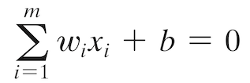
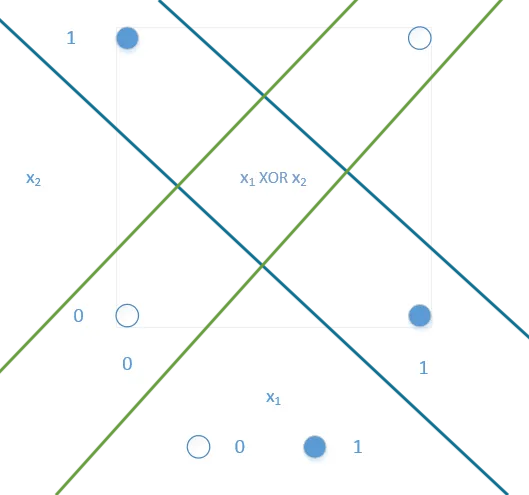

# HW 1 

## Q2. 
_The study of the single-layer perceptron presented in the class is in the context of the McCulloh-Pitts model of a neuron. The nonlinear element of this model is represented by a hard limiter as its output end. It would be tempting to think that we can do better (than classification just linearly separable patterns) if we were to use a sigmoidal nonlinear element in place of the hard limiter. Well, it turns out that the steady-state, decision-making characteristics of a single-layer perceptron are basically the same, regardless of whether we use hard-limiting or soft-limiting (differentiable nonlinear transfer function) as the source of nonlinearity in the neural model (Shynk and Bershad, 1991, 1992; Shynk, 1990). We may therefore state formally that so long as we limit ourselves to the model of a neuron that consists of a linear combiner followed by a nonlinear element, then regardless of the form of nonlinearity used, a single-layer perceptron can perform pattern classification only on linearly separable patterns. Justify/demonstrate the validity of the above thesis._

### Answer 

The single-layer perceptron can perform pattern classification only on linearly separable patterns because of the mathematical model used.
The _Linear Combiner_  can only define the _Hyperplane_ 




_Plane surface_  in 3D: 
  
*W0 * b + W1 * x + W2 * y + W3 * z = 0*

_Line_ in 2D: 

*W0 * b + W1 * x + W2 * y = 0*


## Q3. 
_The perceptron may be used to perform numerous logic functions. Demonstrate the implementation of the binary logic functions AND, OR, and COMPLEMENT. However, a basic limitation of the perceptron is that it cannot implement the EXCLUSIVE OR function. Justify/demonstrate the validity of this limitation._

### The model for *AND*. 

The _W_ of _[ -1.5, 1, 1 ]_ makes the step activation function computes `1` only if both inputs are `1`s:

|           b |          x1 |      x2 |      summation | step activation |
| :---------: | :---------: | :-----: |            --: | --:             |
|           1 |           1 |       1 | -1.5x1+1x1+1x1 | 0.5 > 0 => 1    |
|           1 |           1 |       0 | -1.5x1+1x1+1x0 | -0.5 < 0 => 0   |
|           1 |           0 |       1 | -1.5x1+1x0+1x1 | -0.5 < 0 => 0   |
|           1 |           0 |       0 | -1.5x1+1x0+1x0 | -1.5 < 0 => 0   |

The `1` is `true`, the `0` is `false`.

### The model for *OR*. 

The _W_ of _[ -0.5, 1, 1 ]_ the step acctivation computes `0` only if both inputs are `0`s. 

|           b |          x1 |      x2 |      summation | step activation |
| :---------: | :---------: | :-----: |            --: | --:             |
|           1 |           1 |       1 | -0.5x1+1x1+1x1 | 1.5 > 0 => 1    |
|           1 |           1 |       0 | -0.5x1+1x1+1x0 | 0.5 > 0 => 1    |
|           1 |           0 |       1 | -0.5x1+1x0+1x1 | 0.5 > 0 => 1    |
|           1 |           0 |       0 | -0.5x1+1x0+1x0 | -0.5 < 0 => 0   |

The `1` is `true`, the `0` is `false`. 

### The model for *COMPLEMENT* AKA *NOT*. 

The _W_ of _[ 0, 1 ]_ the step acctivation computes `0` only if both inputs are `0`s. 

|           b |          x1 | summation | step activation |
| :---------: | :---------: |       --: | --:             |
|           1 |           1 |   0x1+1x1 | 1 > 0 => 1      |
|           1 |           0 |   0x1+1x0 | 0 <= 0 => 1     |


The `1` is `true`, the `0` is `false`. 

### The _XOR_ problem

The picture bellow shows that all four lines, defining the area where at least two points of one class belong, have introduced the error in classification.




## Choice #1: Implementation of a Perceptron Network

Design goals:
* Multiple layers running at the same time - DONE
* Forward propagation -  have layers talking to each other fully/partially connected - TODO
* Back propagation between layers for derivable transfer functions like `:sigmoid` - TODO

The TODO left in scope of HW1:

* multiple dataset tests with measuring accuracy and errors
* better reporting of results and showing progress

The TODO left in scope of usability:
* reduce burden to replicate - wrap into Docker container


The programm is implemented in [`Elixir`](https://elixir-lang.org/) language
Please refer to [install guide](https://elixir-lang.org/install.html)
Clone this repo and `cd` the projec directory. Then run the following commands


```Elixir
  mix deps.get
  mix deps.compile
  mix compile
  iex -S mix
```

This will:
* pull the dependencies
* compile the dependencies
* compile the project
* start `Elixir` shell 


The project relyes on [Matrex project](https://github.com/versilov/matrex) for all matrix manipultions - the Elixir interface to `CBLAS`. 

Start `elixir REPL` by `iex -S mix`

To start training of `:output_layer21` for 10 epocs run this command being in elixir console: 

```Elixir
  Layer.train(2, :output_layer21)
```

### Design details

#### Layer superviser
Each `layer` runs in it's own process, controlled by application supervisor:

[layers_sup.ex](lib/layers/layers_sup.ex)

The supervisor is passed the `topology` from [config.exs](config/config.exs#L8) that creates all the layers as separate processes:

```Elixir
    children = Enum.map(topology,
      fn({layer_name, activation_function, inputs, neurons, learning_rate, field}) ->
        worker(Layer,
          [layer_name, activation_function, inputs, neurons, learning_rate, field],
          [id: layer_name, function: :new])
      end)
    supervise(children, [strategy: :one_for_one])

```
See the details in code:
* Full continuity[Layer.ex](lib/layers/layer.ex#L145) 
* Taking continuity literally [Layer.ex](lib/layers/layer.ex#L149) 


#### most important functions

* [infer](lib/layers/layer.ex#L114)
* [learn_once](lib/layers/layer.ex#L97)
* [train](lib/layers/layer.ex#L50)


### Any number of input and output nodes
The [Layer](lib/layers/layer.ex) supports any number of input and output with configuration in [config.exs](config/config.exs)
The layer bellow is configured with 2 inputs and 1 output 
```
  {:output_layer21, :hard_limit, 2, 1, 0.5, [] } # full continuity
```

### Continuum of fully-connected networks and partially-connected networks
The [config.exs](config/config.exs) supports the specification of `field` with lists of `1`s or `0`s.
The the position index of the 0 or 1 in ther list tells to block or allow the weights to be updated with the signal from the respective source.
See the details in code [Layer.ex](lib/layers/layer.ex#L136)


```
config :layers, topology: [
  # {:input_layer,:sigmoid, 5, 3, 1, [[1,1,0,1,0,1],[1,1,1,1,1,1],[1,0,1,0,1,0]] }, # restricted field
```
The `field` defined as folowing for 5 input and 3 output: 
```
[[1,1,0,1,0,1],[1,1,1,1,1,1],[1,0,1,0,1,0]]
```
Each list has 6 elements for 5 inputs to accomodate `bias`


### Provision for the user to provide:
- Network configuration information,
- Learning rate, and

The [config.exs](config/config.exs) supports the specification of number of inputs and number of outputs:
```
  {:output_layer21, :hard_limit, 2, 1, 0.5, [] } # full continuity
```
The `2` is number of inputs `1` - outputs, `0.5` - eta AKA learning rate, `[]` is the empty list of `field`

TODO - Location of training and testing data sets through a parameter file that can be passed to the executable

This feature is not yet implemented but I am working on it.

### Program should provide constant feedback to the user in terms of network performance during training and execution

The output shown bellow is the result of running `:output_layer21` that is configured with full continuity of two inputs, one output that uses `:hard_limit` activation function.  

The dataset used to training is embeded into the code: 

[Layer.ex](lib/layers/layer.ex#L53)


#### Output
`Input Vector` shows vector from dataset
`Y = ..` shows target value
`W updates = ... ` prints the concluded updates to the `W`
`new W = ..` shows new valuse for `W`
 
```Elixir

iex(1)> Layer.train(2, :output_layer21)

06:15:21.857 [info]  Input Vector  = #Matrex[1×2]
┌                 ┐
│ 2.78108 2.55054 │
└                 ┘ , Y = 0.0
 
06:15:21.857 [info]  W updates = #Matrex[1×3]
┌                         ┐
│    -0.5-1.39054-1.27527 │
└                         ┘
 
06:15:21.857 [info]  new W = #Matrex[1×3]
┌                         ┐
│-0.19787-1.18677-0.59787 │
└                         ┘
 
06:15:21.857 [info]  Input Vector  = #Matrex[1×2]
┌                 ┐
│ 1.46549 2.36213 │
└                 ┘ , Y = 0.0
 
06:15:21.857 [info]  W updates = #Matrex[1×3]
┌                         ┐
│     0.0     0.0     0.0 │
└                         ┘
 
06:15:21.857 [info]  new W = #Matrex[1×3]
┌                         ┐
│-0.19787-1.18677-0.59787 │
└                         ┘
 
06:15:21.857 [info]  Input Vector  = #Matrex[1×2]
┌                 ┐
│ 3.39656 4.40029 │
└                 ┘ , Y = 0.0
 
06:15:21.857 [info]  W updates = #Matrex[1×3]
┌                         ┐
│     0.0     0.0     0.0 │
└                         ┘
 
06:15:21.857 [info]  new W = #Matrex[1×3]
┌                         ┐
│-0.19787-1.18677-0.59787 │
└                         ┘
 
06:15:21.858 [info]  Input Vector  = #Matrex[1×2]
┌                 ┐
│ 1.38807 1.85022 │
└                 ┘ , Y = 0.0
 
06:15:21.858 [info]  W updates = #Matrex[1×3]
┌                         ┐
│     0.0     0.0     0.0 │
└                         ┘
 
06:15:21.858 [info]  new W = #Matrex[1×3]
┌                         ┐
│-0.19787-1.18677-0.59787 │
└                         ┘
 
06:15:21.858 [info]  Input Vector  = #Matrex[1×2]
┌                 ┐
│ 3.06407 3.00531 │
└                 ┘ , Y = 0.0
 
06:15:21.858 [info]  W updates = #Matrex[1×3]
┌                         ┐
│     0.0     0.0     0.0 │
└                         ┘
 
06:15:21.858 [info]  new W = #Matrex[1×3]
┌                         ┐
│-0.19787-1.18677-0.59787 │
└                         ┘
 
06:15:21.858 [info]  Input Vector  = #Matrex[1×2]
┌                 ┐
│ 7.62753 2.75926 │
└                 ┘ , Y = 1.0
 
06:15:21.858 [info]  W updates = #Matrex[1×3]
┌                         ┐
│     0.5 3.81377 1.37963 │
└                         ┘
 
06:15:21.858 [info]  new W = #Matrex[1×3]
┌                         ┐
│ 0.30213   2.627 0.78176 │
└                         ┘
 
06:15:21.858 [info]  Input Vector  = #Matrex[1×2]
┌                 ┐
│ 5.33244 2.08863 │
└                 ┘ , Y = 1.0
 
06:15:21.859 [info]  W updates = #Matrex[1×3]
┌                         ┐
│     0.0     0.0     0.0 │
└                         ┘
 
06:15:21.859 [info]  new W = #Matrex[1×3]
┌                         ┐
│ 0.30213   2.627 0.78176 │
└                         ┘
 
06:15:21.859 [info]  Input Vector  = #Matrex[1×2]
┌                 ┐
│  6.9226 1.77106 │
└                 ┘ , Y = 1.0
 
06:15:21.859 [info]  W updates = #Matrex[1×3]
┌                         ┐
│     0.0     0.0     0.0 │
└                         ┘
 
06:15:21.859 [info]  new W = #Matrex[1×3]
┌                         ┐
│ 0.30213   2.627 0.78176 │
└                         ┘
 
06:15:21.859 [info]  Input Vector  = #Matrex[1×2]
┌                 ┐
│ 8.67542-0.24207 │
└                 ┘ , Y = 1.0
 
06:15:21.859 [info]  W updates = #Matrex[1×3]
┌                         ┐
│     0.0     0.0     0.0 │
└                         ┘
 
06:15:21.859 [info]  new W = #Matrex[1×3]
┌                         ┐
│ 0.30213   2.627 0.78176 │
└                         ┘
 
06:15:21.859 [info]  Input Vector  = #Matrex[1×2]
┌                 ┐
│ 7.67376 3.50856 │
└                 ┘ , Y = 1.0
 
06:15:21.859 [info]  W updates = #Matrex[1×3]
┌                         ┐
│     0.0     0.0     0.0 │
└                         ┘
 
06:15:21.859 [info]  new W = #Matrex[1×3]
┌                         ┐
│ 0.30213   2.627 0.78176 │
└                         ┘
 
06:15:21.859 [info]  Epoc = 1
 
06:15:21.860 [info]  Input Vector  = #Matrex[1×2]
┌                 ┐
│ 2.78108 2.55054 │
└                 ┘ , Y = 0.0
 
06:15:21.860 [info]  W updates = #Matrex[1×3]
┌                         ┐
│    -0.5-1.39054-1.27527 │
└                         ┘
 
06:15:21.860 [info]  new W = #Matrex[1×3]
┌                         ┐
│-0.19787 1.23645-0.49351 │
└                         ┘
 
06:15:21.860 [info]  Input Vector  = #Matrex[1×2]
┌                 ┐
│ 1.46549 2.36213 │
└                 ┘ , Y = 0.0
 
06:15:21.860 [info]  W updates = #Matrex[1×3]
┌                         ┐
│    -0.5-0.73274-1.18106 │
└                         ┘
 
06:15:21.860 [info]  new W = #Matrex[1×3]
┌                         ┐
│-0.69787 0.50371-1.67457 │
└                         ┘
 
06:15:21.860 [info]  Input Vector  = #Matrex[1×2]
┌                 ┐
│ 3.39656 4.40029 │
└                 ┘ , Y = 0.0
 
06:15:21.860 [info]  W updates = #Matrex[1×3]
┌                         ┐
│     0.0     0.0     0.0 │
└                         ┘
 
06:15:21.860 [info]  new W = #Matrex[1×3]
┌                         ┐
│-0.69787 0.50371-1.67457 │
└                         ┘
 
06:15:21.860 [info]  Input Vector  = #Matrex[1×2]
┌                 ┐
│ 1.38807 1.85022 │
└                 ┘ , Y = 0.0
 
06:15:21.860 [info]  W updates = #Matrex[1×3]
┌                         ┐
│     0.0     0.0     0.0 │
└                         ┘
 
06:15:21.861 [info]  new W = #Matrex[1×3]
┌                         ┐
│-0.69787 0.50371-1.67457 │
└                         ┘
 
06:15:21.861 [info]  Input Vector  = #Matrex[1×2]
┌                 ┐
│ 3.06407 3.00531 │
└                 ┘ , Y = 0.0
 
06:15:21.861 [info]  W updates = #Matrex[1×3]
┌                         ┐
│     0.0     0.0     0.0 │
└                         ┘
 
06:15:21.861 [info]  new W = #Matrex[1×3]
┌                         ┐
│-0.69787 0.50371-1.67457 │
└                         ┘
 
06:15:21.861 [info]  Input Vector  = #Matrex[1×2]
┌                 ┐
│ 7.62753 2.75926 │
└                 ┘ , Y = 1.0
 
06:15:21.861 [info]  W updates = #Matrex[1×3]
┌                         ┐
│     0.5 3.81377 1.37963 │
└                         ┘
 
06:15:21.861 [info]  new W = #Matrex[1×3]
┌                         ┐
│-0.19787 4.31747-0.29494 │
└                         ┘
 
06:15:21.861 [info]  Input Vector  = #Matrex[1×2]
┌                 ┐
│ 5.33244 2.08863 │
└                 ┘ , Y = 1.0
 
06:15:21.861 [info]  W updates = #Matrex[1×3]
┌                         ┐
│     0.0     0.0     0.0 │
└                         ┘
 
06:15:21.862 [info]  new W = #Matrex[1×3]
┌                         ┐
│-0.19787 4.31747-0.29494 │
└                         ┘
 
06:15:21.862 [info]  Input Vector  = #Matrex[1×2]
┌                 ┐
│  6.9226 1.77106 │
└                 ┘ , Y = 1.0
 
06:15:21.862 [info]  W updates = #Matrex[1×3]
┌                         ┐
│     0.0     0.0     0.0 │
└                         ┘
 
06:15:21.862 [info]  new W = #Matrex[1×3]
┌                         ┐
│-0.19787 4.31747-0.29494 │
└                         ┘
 
06:15:21.862 [info]  Input Vector  = #Matrex[1×2]
┌                 ┐
│ 8.67542-0.24207 │
└                 ┘ , Y = 1.0
 
06:15:21.862 [info]  W updates = #Matrex[1×3]
┌                         ┐
│     0.0     0.0     0.0 │
└                         ┘
 
06:15:21.862 [info]  new W = #Matrex[1×3]
┌                         ┐
│-0.19787 4.31747-0.29494 │
└                         ┘
 
06:15:21.862 [info]  Input Vector  = #Matrex[1×2]
┌                 ┐
│ 7.67376 3.50856 │
└                 ┘ , Y = 1.0
 
06:15:21.862 [info]  W updates = #Matrex[1×3]
┌                         ┐
│     0.0     0.0     0.0 │
└                         ┘
 
06:15:21.862 [info]  new W = #Matrex[1×3]
┌                         ┐
│-0.19787 4.31747-0.29494 │
└                         ┘
 
06:15:21.862 [info]  Epoc = 2
 
06:15:21.868 [info]  layer = %Layer{errors: #Matrex[21×1]
┌         ┐
│     0.0 │
│     0.0 │
│     0.0 │
│     0.0 │
│     1.0 │
│     0.0 │
│     0.0 │
│     0.0 │
│    -1.0 │
│    -1.0 │
│     0.0 │
│     0.0 │
│     0.0 │
│     0.0 │
│     1.0 │
│     0.0 │
│     0.0 │
│     0.0 │
│     0.0 │
│    -1.0 │
│     0.0 │
└         ┘, eta: 0.5, field: #Matrex[1×3]
┌                         ┐
│     1.0     1.0     1.0 │
└                         ┘, name: :output_layer21, pid: #PID<0.190.0>, w: #Matrex[1×3]
┌                         ┐
│-0.19787 4.31747-0.29494 │
└                         ┘}
:ok
iex(2)> 
```

### TODO The code will be tested against different data sets.


## Literature
* 
